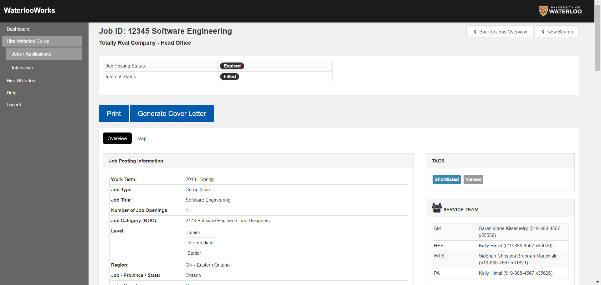
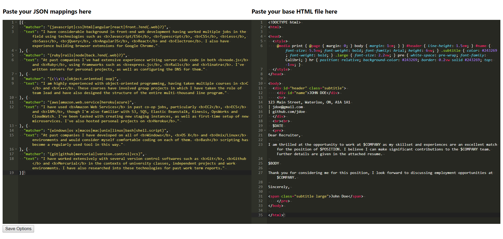
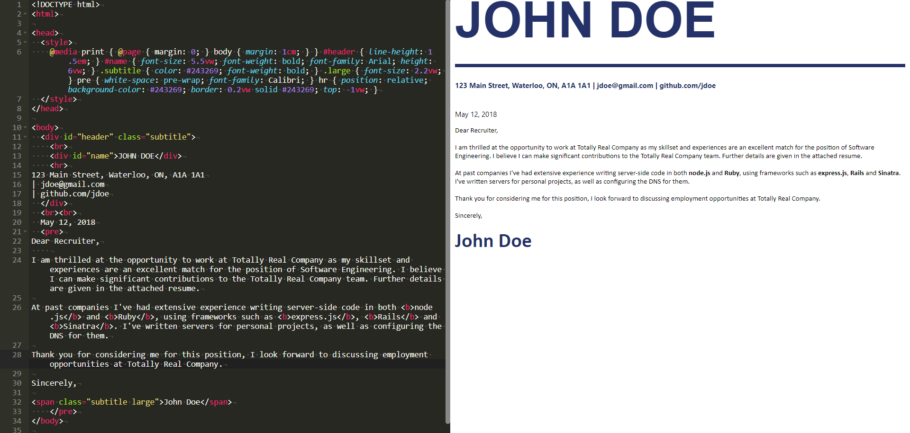

# CoverWorks

Chrome extension that adds a "Generate Cover Letter" button to job postings that will auto-generate a cover letter for the posting. [Download it on the Chrome store](https://chrome.google.com/webstore/detail/maafneclmoeadjjnhihbnpgnnbmlibpi)

*Note: CoverWorks is still in development. It may still have bugs and/or terrible UI*

## How to use
### 1. Initialize matchings and HTML template
When you install CoverWorks you will be shown the below page. CoverWorks works by trying to match the job description with a series of regular expressions. If a given regex matches the job description, CoverWorks will add an associated paragraph to the generated cover letter.

CoverWorks needs the user to supply it two files. First, A JSON file describing the regular expressions and their associated paragraphs. Second, an HTML file which CoverWorks will use as a template for generating cover letters. Samples of these two files are shown on first install, and also can be seen in the screenshot below.

In order for CoverWorks to know where to insert generated content into the HTML template, the user can put certain keywords into the template. CoverWorks will replace all instances of a keyword with the proper content. The valid keywords are as follows:
* `$BODY` - Will be replaced with the paragraphs selected by the regex matches
* `$POSITION` - Will be replaced by the name of the position
* `$COMPANY` - Will be replaced by the name of the company
* `$DATE` - Will be replaced by the current date

### 2. Generate the cover letter
To generate a cover letter, navigate to the job posting and click the "Generate Cover Letter" button. The cover letter will be generated, and you will be taken to an editor page. That's it.

### 3. Edit and save the cover letter
On the editor page you will be shown the generated cover letter, along a live preview. Simply make any tweaks to the content you wish, then export to PDF by printing the page (Ctrl-p/Cmd-p)

